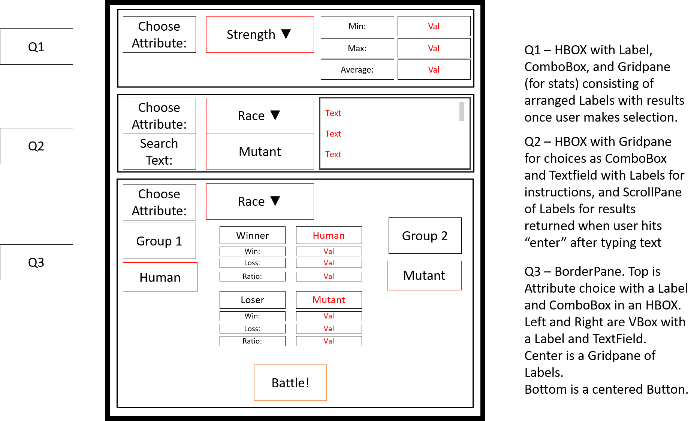

# project2
# Final Project - Design your own Data Analysis App

In this course we have analyzed several data sets and created many small applications. This final project will be larger, and consists of two parts, each of which is considered its own graded assignment. 

For the first part (Project 5 in Canvas) you will:

- Identify a dataset that *you are motivated* to analyze. You will verify that this dataset is in a format that you can parse using the methods we have established in previous projects.
- Clearly articulate a list of questions that you want to want to answer about the dataset.  Identify which algorithms and quantitative analysis methods will be needed to answer your questions.
- Sketch a user interface that you will develop in JavaFX to load the dataset and present the results to a user
- Outline the classes that you will design and how they relate to each other. Implement the classes that you will need only up the **method stub** level.

For the second step (Project 6 in Canvas) you will: 

- Implement the remaining method bodies from the stubs you have developed.
- Develop the user interface in JavaFx that you sketched.
- Develop test cases for your quantitative analysis methods.
- Provide a user manual and documentation of analysis of your dataset using the application you have developed.


## Step 1: Identify a dataset

Identify a dataset that *you are motivated* to analyze. You will verify that this dataset is in a format that you can parse using the methods we have established in previous projects.

The Data is Plural archive (link below) contains more than one thousand datasets that have been analyzed for news articles, non-profits, and fun. Interested in scooter laws? There's a dataset for that. Polling places? Check. Swear words associated with Shutterstock images, including swear words in other languages? It's there.

[https://docs.google.com/spreadsheets/d/1wZhPLMCHKJvwOkP4juclhjFgqIY8fQFMemwKL2c64vk/edit#gid=0](https://docs.google.com/spreadsheets/d/1wZhPLMCHKJvwOkP4juclhjFgqIY8fQFMemwKL2c64vk/edit#gid=0)

For this step, you need to do two things. First is to browse through the (admittedly long) list of datasets that are available for you to use in this project. Keep a text file open or some other note-taking so that you can remember your top choices. At this stage, I recommend coming up with a longer list of options for yourself before digging into the datasets in too much detail. Try to choose datasets that interest you - there are datasets all over the place here, so it should not be too hard to find several that grab your attention. 

Once you have your short list of candidates, next begins the harder part of this - verifying that you can access and parse the data using Java. Not all of the datasets use the comma-separated value format we have used in the past, so you might have to open the files for your chosen dataset and save them in that format. We have also only looked at simple versions of the csv format, in which the fields of a record were separated by commas but did not contain commas themselves. I purposefully saved you from this complexity by directly editing the files to remove commas from fields, but these datasets are not all prepared in that way. If you take a look at a dataset, and cannot parse it, you might have to go to another dataset from your list of candidates. You can include multiple data files, as long as they are associated with the same overall data set (do not mix and match from separate rows in the archive).

EDIT THIS: My chosen dataset is HEADLINE which is number POSITION in the EDITION edition. 

**Deliverable 1:**  To summarize, here’s what you need to do.
1. Download one or more data files associated with one of the projects on the Data is Plural archive. Put the data files in your repo in the data directory. Edit the line above so that we know what your dataset will be. 
2. Implement a class that parses at least one of the datasets in a static method. In a separate `Test` class with a main method call the read method for initial testing. These are the only methods that cannot be method stubs in your code submission for Project 5.

## Step 2: List questions and identify algorithms

Clearly articulate a list of questions that you want to want to answer about the dataset. Identify which algorithms and quantitative analysis methods will be needed to answer your questions.

We have taken a look at many strategies for analyzing data in this class so far. We have developed a mock algorithm for a self-driving car and tested it with a huge number of random scenarios. This allowed us to see which type of people (or animals) the algorithm preserved. We analyzed pairings of super heroes classes to see what qualities make a super hero the strongest. We have also looked at a strategy for a small question with a big number of possible answers that would be nearly impossible to solve without recursion.

Between these approaches, and other approaches covered in class, we have developed a fairly extensive inventory of methods for analyzing the characteristics of a data set using Java. For this project, however, you are given the chance to come up with your own questions. 

There are little questions and big questions. Little questions are relatively straightforward to answer using only a few built in commands. Big questions are often built upon combining the results from many little questions to give more insight into the data. 

For the superhero dataset, a little question might be:

> What is the min, max, and average value of one of the attributes (e.g., strength)?

Each of these values give a sense for the distribution of values for that attribute, and can be calculated using a loop and some built in comparison methods. Some questions might seem small, but when you start to answer them, there might be hidden challenges that begin to make it feel like a big question. 

For the superhero dataset, a big question might be: 

> If all of the human superheroes fought all of the non-human superheroes, and each superhero attacked with the attribute that is their highest, which category would have best ratio of wins to losses?

In this question, it's possible that multiple support classes would need to be created or the superheroes would have to be grouped in some way using a data structure. The question has a very direct answer, but it relies on several smaller steps to get to that answer. Big questions are often based on hypothetical comparisons between groups or a designed response to many "what if" scenarios. We have seen examples of both.

Some questions are somewhere in between:

> What is the median value of one of the attributes (e.g., strength)?

Median is tougher to figure out because you have to sort all of the records by that attribute first, and there are a few approaches to doing this depending on how generalizable you want your system to be. It's not quite a big question, but requires more work than a little question. For this, you would need to describe how you would sort using a named algorithm (either using an existing Java library or one from the textbook).

You need to identify three questions (one big, two little) for this assignment. Your questions do not have to work together, but it could be helpful if they do. Your questions should each have at least one part that is variable by user input. 

An example list:

1. What is the min, max, and average value of one of the attributes (e.g., strength) as specified by a user? (little)
2. How many, and which, superheroes have an attribute that contains a word typed in by the user? (little)
3. If all of the human superheroes fought all of the non-human superheroes, and each superhero attacked with the attribute that is their highest, which category would have best ratio of wins to losses? (big)

Once you have identified your list, you need to begin thinking early about your strategy for getting answers to these questions. These can be in simple prose, but they need to be descriptive.

 1. What is the min, max, and average value of one of the attributes (e.g., strength) as specified by a user? (little)
    - I will develop a method getStats() that takes an arraylist of superhero objects and a String that specifies an attribute. the method will iterate over the list with a for loop to identify the min and max of that attribute, which I will obtain using a switch statement on the attribute parameter. I will add a rolling sum of the attribute during the iteration, and then I will divide that rolling sum by the number of superheros in the list to get the average. The method will return a double array with three elements: min, max, and average in indices 0, 1, and 2.
 2. How many, and which, superheroes have a description that contains a word typed in by the user? (little)
    - I will develop a method getListThatContainsString() that takes an arraylist of superhero objects, a String that specifies a word that is being searched for, and a string that specifies the attribute. if the string for the attribute is not the name of one of the text-based attributes an exception is thrown. the method will iterate over the list with a for loop, using the contains() method on each superhero field for that attribute. if so, then that superhero is added to a new arraylist. the arraylist is returned by the method after the for loop ends.
 3. If all of the human superheroes fought all of the mutant superheroes, and each superhero attacked with the attribute that is their highest, which category would have best ratio of wins to losses? (big)
    - I will develop a method battleRoyale() that takes two arraylists of Superhero objects. I will develop a helper method, getMaxAttribute(), that takes a superhero and returns the int that is the highest of all the superhero numeric attributes. I will use my getListThatContainsString() to make two lists based on the attribute that is being used to separate the superheroes into two lists (e.g., "race") and will take two String parameters used to make the lists (e.g., "human" and "mutant"). These lists will be passed to the battleRoyale() method. It will use a nested-for-loop to pit the two lists against each other, and track the wins and losses for each group. Finally, it will return a FightResults object, which is a class that contains a String naming the winner, a String naming the loser, and two 2-element arrays of the win/loss records for each.
    
EDIT THIS: YOUR LIST
    
**Deliverable 2:**  To summarize, here’s what you need to do.
1. Write your list of three questions here in the readme. Identify which ones are little and which one is big.  
2. In prose, articulate your intended approach using the example provided above. Be clear about what methods and classes you will need to create.

## Step 3: Sketch a user interface

Sketch a user interface that you will develop in JavaFX to load the dataset and present the results to a user.

As you can tell from the description above, your analysis will not be static, but will be driven by user input in an interface. That means you need to provide a simple mechanism for the user to provide those variables.

First, start with an overall layout. For most of you, the default will be BorderPane, but it does not have to be. A FlowPane or a GridPane might be exactly what you need. Think about your questions, and how they relate to each other (if at all). Do the results from a little question feed into the parameters for the big question? If so, maybe go top down starting with small panes for the little questions at the top and the big question at the bottom. Do you expect the big question results to be further analyzed as little questions? Then maybe start with the big question on top.  

For each component of the overall layout, which pane or node from JavaFX could go here? You might have a few options! The interior of a pane could work just fine with either a GridPane or a BorderPane, but maybe one looks better? Think about the possibilities, and go with what seems best at this point. You are always free to change your mind later, but it's better to start with a plan!

Finally, within the layout, which components are static (defined beforehand) and which ones are updated by user input or the result of your program finishing some component of analysis? For selections that users are going to make, do you want to provide them with a small list of options (e.g., through a ComboBox or RadioButton) or something more open-ended (e.g., a TextBox or FileLoader)?



**Deliverable 3:**  To summarize, here’s what you need to do.
1. In the img directory, provide an image of your sketch for the user interface.
2. Clearly identify JavaFX classes of each component or node in the sketch. Using a red outline, clearly identify the parts that the user will be able to interact with and which of your analysis questions they relate to ("Q1", "Q2", or "Q3"). If a value changes based on user input, make that text red.

## Step 4: Outline the Classes

Outline the classes that you will design and how they relate to each other.  Implement the classes that you will need only up the **method stub** level.

For your questions identified in Step 2, go ahead and create the source files, method headers, and stubs. Remember, a method stub does not contain a method body, but it does return something appropriate for the return type. 

Here is an example for the `battleRoyale()` and `getMaxAttribute()` methods described in the big question example: 

```java
public static FightResult battleRoyale(ArrayList<SuperHero> listA, ArrayList<SuperHero> listB){
    //Implement method body with for loop later


    return new FightResult();
}

public static int getMaxAttribute(SuperHero hero){
    //Figure out which attribute is the highest
    
    return -1;
}
```

While these methods do not quite work yet, they do return a value of the correct type and compile - that is all we need at this stage. For your analysis questions defined above, it should be clear that you have planned enough to think about how to translate your prose algorithms into methods and classes. Again, they do not need to work yet, but they **must compile**. They must also be complete, and fully represent what you intend to do - (not counting the JavaFX). Do not skimp out here to make this part easier - it's likely to bite you down the road when you start building the method bodies.

**Deliverable 4:**  To summarize, here’s what you need to do.
1. In the src directory, provide starting code for the classes and methods that you will need to answer your questions. This will not include the JavaFX code at this stage.
2. In the same `Test` class that demonstrates that your file loads correctly and is parsed, demonstrate that you can create instances of your classes and call your methods.


# Part II - Build it (A Preview)

- Implement the remaining method bodies from the stubs you have developed.
- Develop the user interface in JavaFx that you sketched.
- Develop test cases for your quantitative analysis methods.
- Provide a user manual (max 2 pages) that describes how to use your interface and describes the results of analyzing the dataset using the application you have developed with some of the possible user input values.

# Deliverables and Grading (Part I Only)
| Weight | Deliverable                 |
|--------|-----------------------------------------------------------------------------------------------------------------------|
| 25     | Choose a dataset and demonstrate that you can correctly parse the data using Java. |
| 25     | Using prose, describe your questions and your plan for analysis using specific algorithms, classes, and methods. |
| 25     | Give us a labelled sketch for your planned graphical user interface. |
| 25     | Write the class definitions and method headers that you will need to answer your questions. |

